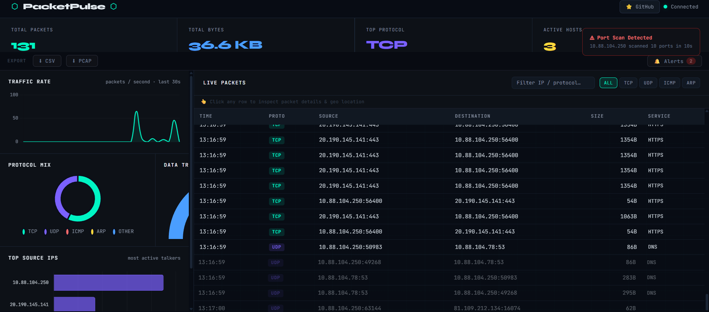

# 🌐 PacketPulse

> A real-time network traffic visualizer — like a heartbeat monitor for your internet.

PacketPulse captures live packets flowing through your network and displays them in a beautiful, readable dashboard. Built for students and developers who want to understand what's *actually* happening on their network — without drowning in Wireshark's complexity.


---

## ✨ Features

| Feature | Status |
|---|---|
| Live packet capture (TCP, UDP, ICMP, ARP, DNS) | ✅ |
| Real-time WebSocket streaming to browser | ✅ |
| Live dashboard — protocol filter, search, pause | ✅ |
| Traffic charts — sparkline, donut, gauge, bar | ✅ |
| Click-to-inspect — full packet details + hex payload | ✅ |
| Geo IP lookup — country flag, city, ISP | ✅ |
| Alert system — port scan detection, suspicious ports | ✅ |
| Export captures as CSV or PCAP | ✅ |
| Demo mode — works without root or Npcap | ✅ |

---

## 📸 Dashboard

> Live packets, charts, inspector panel and alerts — all in one view.



---

## ⚡ Quick start

### Option A — Demo mode (no root required)

```bash
git clone https://github.com/jaissamant/packetpulse.git
cd packetpulse
pip install -r requirements.txt
python demo_server.py
```

Open `http://localhost:5001` in your browser.

### Option B — Live capture mode

```bash
# Windows (run terminal as Administrator)
python server.py

# Mac/Linux
sudo python server.py
```

Open `http://localhost:5000` in your browser.

---

## 🛠 Tech stack

- **Backend** — Python 3.10+, Scapy, Flask, Flask-SocketIO
- **Frontend** — Vanilla HTML/CSS/JS (no build tools, no npm)
- **Charts** — Chart.js 4.4 (CDN)
- **Geo IP** — ip-api.com (free tier, no key needed)
- **Fonts** — JetBrains Mono, Syne (Google Fonts)

---

## 📁 Project structure

```
packetpulse/
├── server.py              # Live capture server
├── demo_server.py         # Demo mode (no root)
├── config.py              # Configuration
├── requirements.txt
├── Makefile               # make run / make demo / make install
│
├── capture/
│   ├── engine.py          # PacketCapture class + parser
│   └── exporter.py        # CSV / PCAP export
│
├── api/
│   ├── routes.py          # REST endpoints
│   ├── socket_events.py   # WebSocket events
│   ├── alerts.py          # Alert engine
│   └── geo.py             # Geo IP lookup
│
├── frontend/
│   ├── index.html         # Dashboard
│   ├── css/
│   │   ├── main.css       # Core styles
│   │   ├── inspector.css  # Inspector panel
│   │   └── alerts.css     # Alert panel
│   └── js/
│       ├── socket.js      # WebSocket client
│       ├── table.js       # Packet table
│       ├── stats.js       # Stat cards
│       ├── charts.js      # Chart.js charts
│       ├── inspector.js   # Inspector panel
│       ├── alerts.js      # Alert panel
│       └── app.js         # Main wiring
│
└── demo/
    └── mock_data.json     # Demo capture data
```

---

## 🔒 Permissions note

Raw packet capture requires elevated privileges:

- **Windows** — run terminal as Administrator + install [Npcap](https://npcap.com)
- **Mac/Linux** — prefix with `sudo`
- **Demo mode** — no privileges needed, runs on mock data

See [docs/SETUP.md](docs/SETUP.md) for full setup instructions.

---

## 📄 License

MIT © 2026
